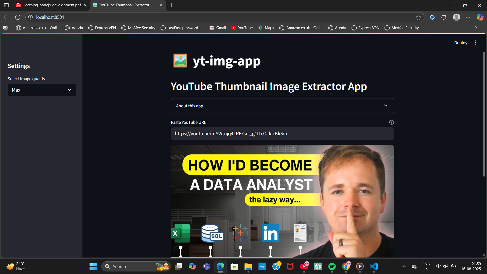

# YouTube Thumbnail Image Extractor App

## 🖼️ yt-img-app

A simple, production-ready Streamlit app to extract and display the thumbnail image from any YouTube video URL. 

---

## Features
- Paste any YouTube video URL and instantly view its thumbnail.
- Choose from multiple image quality options (Max, High, Medium, Standard).
- Responsive, user-friendly interface.
- Sidebar settings for easy access.
- Error handling for invalid or malformed URLs.

---

## Demo


---

## Getting Started

### 1. Clone the repository
```bash
git clone https://github.com/your-username/yt-img-app.git
cd yt-img-app
```

### 2. Install dependencies
```bash
pip install -r requirements.txt
```

### 3. Run the app
```bash
streamlit run app.py
```

---

## Usage
1. Enter a valid YouTube video URL in the input box.
2. Select the desired image quality from the sidebar.
3. The thumbnail will be displayed below, along with its direct URL.

---

## Project Structure
```
.
├── app.py
├── requirements.txt
└── README.md
```

---

## Contributing
Pull requests are welcome! For major changes, please open an issue first to discuss what you would like to change.

---

## License
[MIT](LICENSE)
